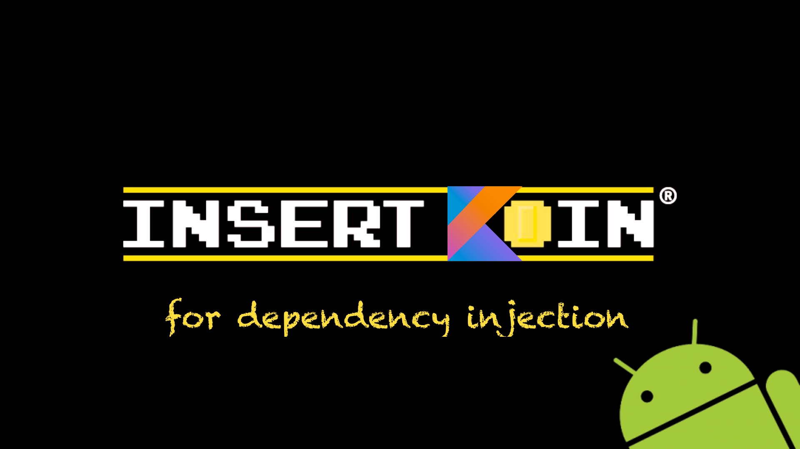

### What's KOIN?

KOIN is a simple (but powerful) dependency injection framework for Android. It uses [Kotlin](https://kotlinlang.org/) and its functional power to get things done!  No proxy/CGLib, no code generation, no introspection. Just functional Kotlin and DSL magic ;)

KOIN is a very small library, that aims to be as simple as possible and let's you write dependency injection in a breath.

*Just describe your stuff and inject it!*

### What's up?

Check the latest changes in [What's New](https://github.com/Ekito/koin/wiki/What's-new-%3F) and the [Roadmap](https://github.com/Ekito/koin/wiki/Roadmap) for next releases.

For users using a version prior to Koin 0.5.x, please refer the [migrating to 0.5.0](https://github.com/Ekito/koin/wiki/Migrating#migrating-to-05x) page to understand the latest changes. 

# Getting Started

## Gradle

Check that you have the `jcenter` repository. Add the following gradle dependency to your Android app:

```gradle
// Koin for Android
compile 'org.koin:koin-android:0.5.1'
// If you need Koin for your tests
testCompile 'org.koin:koin-test:0.5.1'
```

### Setup your Application

To start KOIN and your modules, you just have to use the `startAndroidContext` function in your Android *Application* class like below:

```Kotlin
class MainApplication : Application(){

    override fun onCreate() {
        super.onCreate()
        // Start Koin
        startAndroidContext(this, allModules())
    }
}
```

The `startAndroidContext` function requires an `Application` instance, and a a list of modules to run. A function can manage this for you, check out the `allModules()` function.

## Declaring your dependencies

KOIN requires you to declare your components in modules.

A module class **extends** your [AndroidModule](https://github.com/Ekito/koin/wiki#module-class) class and implements the `context()` function by using the `applicationContext` function builder, to declare a context like below:

```Kotlin
class WeatherModule : AndroidModule() {
    override fun context() = applicationContext {
        // WeatherActivity context
        context(name = "WeatherActivity") {
            // Provide a factory for presenter WeatherContract.Presenter
            provide { WeatherPresenter(get()) }
        }
        
        // Weather data repository
        provide { WeatherRepository(get()) }
        
        // Local Weather DataSource 
        provide { LocalDataSource(AndroidReader(applicationContext) } bind WeatherDatasource::class
    }
}

//for classes
class WeatherPresenter(val weatherRepository: WeatherRepository)
class WeatherRepository(val weatherDatasource: WeatherDatasource)
class LocalDataSource(val jsonReader: JsonReader) : WeatherDatasource
```
Your module then provides an *applicationContext* (description of your components), which will be made of provided components and subcontexts.

You can refer to the [KOIN DSL](https://github.com/Ekito/koin/wiki/Koin-DSL) for more details.

## Making dependency injection

Once your app is configured, you have 2 ways of handling injection in your application:

* In **Android components** (Activity, Fragment etc.): use the `by inject()` lazy operator
* In **any Kotlin component**: injection is made **by constructor**

```Kotlin
// In Android class, use the by inject() operator
class WeatherActivity() : AppCompatActivity() {

    // inject my Presenter 
    val presenter by inject<WeatherPresenter>()

    // you can use your injected dependencies anywhere
}
```

```Kotlin
// In pure Kotlin class, All is injected in constructor
class WeatherPresenter(val weatherRepository: WeatherRepository) {

    // you can use your dependencies here
}
```

## Working with properties

Declare any property from outside of your module :

```kotlin
// Set property key with its value
getKoin().setProperty("key",value)
```

Resolve it in your module with `getProperty("key")` or inject in an Android class with `by property("key")`

You can also easily bind any Android property:


```kotlin
// bind R.string.server_url to Koin WeatherModule.SERVER_URL
getKoin().bindString(R.string.server_url, WeatherModule.SERVER_URL)

```


## Managing context life cycle

One of the biggest value of Koin, is the ability to drop any instances from a given context, to suits your components life cycle. At any moment, you can use the `releaseContext()` function to release all instances from a context.

You can use the `ContextAwareActivity` or `ContextAwareFragent` to automatically drop an associated context:

```kotlin

// A module with a context
class WeatherModule : AndroidModule() {
    override fun context() = applicationContext {
        context(name = "WeatherActivity") {
            provide { WeatherPresenter(get(), get()) }
        }
    }
}

class WeatherActivity : ContextAwareActivity(), WeatherContract.View {
    
    // associated context name
    override val contextName = "WeatherActivity"
    
    override val presenter by inject<WeatherPresenter>()

    //will call releaseContext("WeatherActivity") on onPause() - drop WeatherPresenter instance
}
```

Up to you to adapt it to your project if need, you are not forced to use those ContextAware components. You can make like follow:

```kotlin

abstract class MyCustomActivity : AppCompatActivity() {

    abstract val contextName: String

    override fun onPause() {
        releaseContext(contextName)
        super.onPause()
    }
}

```


## Checking your modules

KOIN is an internal DSL: all your modules evolves directly with your code (if you change a component, it will also impact your modules). 

You can check your modules with `KoinContext.dryRun()` (launch all your modules and try to inject each component). Better is to place it in your tests folder and check it regulary - ensure everything is injected correctly.

in a JUnit test file:

```kotlin
@Test
fun dryRun(){
     val koinContext = Koin().build(allModules()).dryRun()
     // or if you need Application context in your injection
     val koinContext = Koin().init(mock(Application::class.java)).build(allModules()).dryRun()
}
```


## Testing

You can also use Koin for your tests. You can extend the `KoinTest` interface to inject any component from Koin context: 

```kotlin
class LocalWeatherPresenterTest : KoinTest {
    
    // Directly injected
    val presenter by inject<WeatherContract.Presenter>()

    @Mock lateinit var view: WeatherContract.View

    @Before
    fun before() {
        // Mocks
        MockitoAnnotations.initMocks(this)
        // Koin context
        startContext(testLocalDatasource())

        presenter.view = view
    }

    @Test
    fun testDisplayWeather() {
        Assert.assertNotNull(presenter)

        val locationString = "Paris, france"
        presenter.getWeather(locationString)

        Mockito.verify(view).displayWeather(any(), any())
    }
}

```

# The Sample App

The [*koin-sample-app*](https://github.com/Ekito/koin/tree/master/koin-android/koin-sample-app) application offers a complete application sample, with MVP Android style. 

The weather app [wiki page](https://github.com/Ekito/koin/wiki/The-Koin-Sample-App) describes all the KOIN features used.


# Documentation

A global [wiki](https://github.com/Ekito/koin/wiki) documentation page gather all features and references about the KOIN Framework.

## Javadoc 

Generated javadoc is available:

* [koin-core](https://ekito.github.io/koin/javadoc/koin-core/)
* [koin-test](https://ekito.github.io/koin/javadoc/koin-test/)
* [koin-android](https://ekito.github.io/koin/javadoc/koin-android/)

# Articles

* [Kotlin Weekly #64](http://mailchi.mp/kotlinweekly/kotlin-weekly-64?e=e8a57c719f)
* [Insert Koin for dependency injection](https://www.ekito.fr/people/insert-koin-for-dependency-injection/)
* [Better dependency injection for Android](https://proandroiddev.com/better-dependency-injection-for-android-567b93353ad)

# Contact & Support

## Slack
Check the [kotlin slack community](https://kotlinlang.org/community/) and join **#koin** channel

## Github
Don't hesitate to open an issue to discuss about your needs or if you don't a feature for example.

